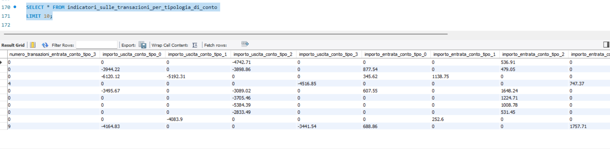

# SQL Feature Engineering per Banking Intelligence 🏦

## 🎯 Obiettivo del Progetto
Il progetto mira a trasformare un database relazionale transazionale in una **tabella di training denormalizzata** per modelli di Machine Learning. L'obiettivo è creare una "Customer 360 View" che sintetizzi il comportamento finanziario di oltre 8.900 clienti attraverso indicatori quantitativi e qualitativi, pronti per analisi predittive.

## 🏗️ Architettura del Database
Il database originale è costituito da 5 tabelle core relazionate tra loro:
* **Cliente**: Informazioni anagrafiche (es. età).
* **Conto & Tipo_Conto**: Dettagli sui conti posseduti e le loro categorie (Base, Business, Privati, Famiglie).
* **Transazioni & Tipo_Transazione**: Dettagli sui flussi finanziari, importi e tipologia (Entrata/Uscita).

## 🛠️ Tecniche SQL Applicate
Nello sviluppo dello script sono state implementate best practices di data engineering per garantire scalabilità e leggibilità:
* **Modularità**: Utilizzo di `TEMPORARY TABLE` per segmentare la logica di calcolo (Anagrafica, Conti, Transazioni).
* **Pivoting condizionale**: Utilizzo della clausola `SUM(CASE WHEN...)` per trasformare record transazionali verticali in feature orizzontali.
* **Data Cleaning**: Standardizzazione dei formati, gestione dei tipi di dato e calcolo dinamico dell'età tramite `TIMESTAMPDIFF`.

### Focus sulla Logica di Calcolo
L'estratto seguente mostra la complessità della logica utilizzata per generare indicatori incrociati tra segno della transazione e tipologia di conto:

  

## 📂 Utilizzo e Struttura del Codice
Il file `.sql` nel repository contiene l'intera pipeline di trasformazione. 
1. **Ambiente**: Il codice è stato sviluppato e testato in ambiente **MySQL**.
2. **Schema**: Richiede la presenza delle tabelle sorgente popolate per generare gli output.
3. **Esecuzione**: Lo script adotta un approccio *non-destructive*, creando tabelle temporanee per la manipolazione del dato senza alterare i record originali.

## 📈 Risultato Finale: Tabella di Feature
La tabella finale `analisi` aggrega tutti gli indicatori per ogni `id_cliente`, fornendo una base solida per:
1. **Predizione del Churn**: Identificazione dei clienti a rischio abbandono.
2. **Cross-Selling**: Personalizzazione delle offerte in base alle abitudini di spesa.
3. **Fraud Detection**: Monitoraggio di anomalie comportamentali.

### Anteprima dei dati generati:

  

---
**Formazione:** Progetto certificato da **ProfessionAI** e **Alteredu**.
**Autore:** [Massimiliano Izzo] – BI & Data Storytelling Specialist
